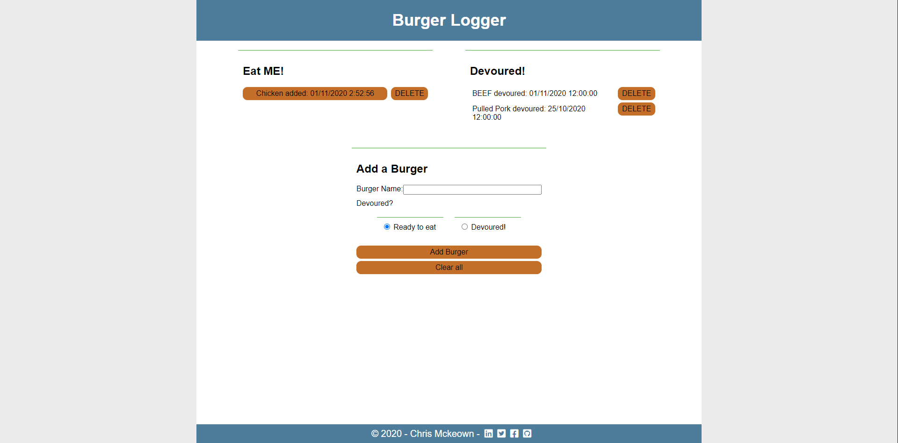

# Burger Logger
    

    
[](https://github.com/chrisjmckeown/burger/blob/master/LICENSE)[](https://GitHub.com/chrisjmckeown/burger/graphs/contributors/)[](https://GitHub.com/chrisjmckeown/burger/pull/)
    
## Description
    
The Burger Logger app that lets users input the names of burgers they'd like to eat, and then track when they have eat them! 
    
## Table of Contents
* [Installation](#Installation)
* [Usage](#Usage)
* [License](#License)
* [Contributing](#Contributing)
* [Tests](#Tests)
* [Questions](#Questions)

## Installation
1. Download and install [Node.js](http://nodejs.org/) (that will install npm as well)
2. Download and install [MySQL Community Server](https://dev.mysql.com/downloads/mysql) and [MySQL Workbench](https://dev.mysql.com/downloads/workbench/). These are the two database tools I used.
4. Install the 3 dependancies.<br />
    ```
    npm install express express-handlebars mysql moment
   ```
5. Use the seed.sql file to create the mysql database and tables.  
6. You are done for the setup, run the readme generator using 
    ```
    node server.js
   ```  

### Technologies Utilized


   

## Usage
 
Once installed:
* Run the Employee Tracker using:
```
   node server.js
```
The app puts burgers in two lists, those to eat on the left, and those devoured on the right. 
* Add burgers you want to eat or have aleady eaten, note the date added.
* Click on an added burger to devoure it. Note the date devoured.
* Delete a burger in either list if a mistake was made.
* Clear all burgers to start from scratch!

 

### Heroku Deployment

View the deployed app here: https://agile-badlands-99229.herokuapp.com/

## License
 
[](https://github.com/chrisjmckeown/burger/blob/master/LICENSE)

## Contributing
 
[](code_of_conduct.md)

## Tests
Test the heroku app to ensure all functionality works as expected. 

## Questions
    
* Follow me at: <a href="https://github.com/chrisjmckeown" target="_blank">https://github.com/chrisjmckeown</a>
    
* Please email with any question at: chris.j.mckeown@hotmail.com
    
© 2020 chrisjmckeown